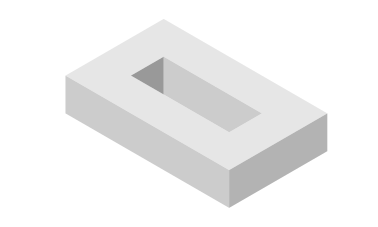

<!-- PROJECT SHEILDS -->
[![Contributors][contributors-shield]][contributors-url]
[![Forks][forks-shield]][forks-url]
[![Stargazers][stars-shield]][stars-url]
[![Issues][issues-shield]][issues-url]

<!-- PROJECT LOGO -->
 

  

## Algorithmic trading

This project seeks to build an algorithmic trading robot to trade shares on the
ASX.

<!-- CONTRIBUTING-->
## Contributing

1. Fork the Project
2. Create a new branch for your feature
3. Commit your changes
4. Push to the branch
5. Open a pull request

<!-- CONTACT -->
## Contact
